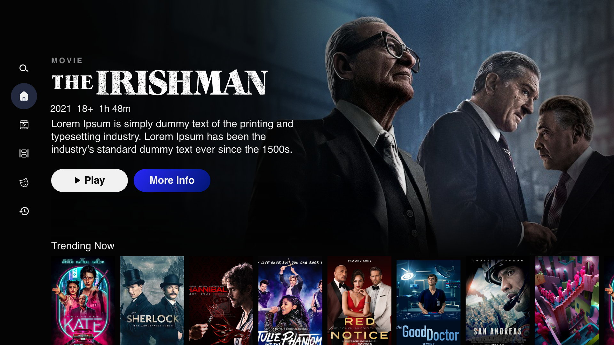

# TV Application Web App

## Task Description

This project involves creating a web application with a specific design focusing on TV content. The application is based on web technologies and utilizes the React.js library. The provided design includes two screens along with a data folder containing assets files such as images, videos, and a JSON data file providing necessary video data for the task.

### Components:

1. **Home Page**
2. **Home Page Menu**

### Details:

#### 1. Main Menu with Icons

The main menu is located on the left side of the screen and consists of icons for Search, Home, TV shows, movies, genres, and watch later. Upon hovering, the menu opens with an animation floating from left to right and a background translation from 0 opacity to 80. The opened view includes profile info icons with names and additional menu items at the bottom (language, get help, exit).

#### 2. Main Featured Video

Located at the top left of the screen, the main featured video block showcases the latest featured movie. It includes:

- Video cover image
- Category name (Movie)
- Movie logo in transparent PNG format
- Release year
- MPA rating
- Duration
- Short description
- Play and more info buttons

#### 3. Trending Now Section

This section displays trending videos with a maximum count of 50, sorted by last added or created from the JSON file. It utilizes a carousel view, showing only the first 8 elements initially. Users can scroll or drag with the mouse to view additional items from the right side. The carousel contains movie cover components.

Upon clicking on any movie, the top featured section content updates with the new movie's image, category, title, and description. After 2 seconds, the featured section's background image changes to a video player in the background position without any controllers. The video associated with the clicked movie plays, utilizing the URL found in the JSON file. The movie ID is saved in session storage, ensuring that during subsequent renders (e.g., page refreshes), the movie list is sorted with the last clicked (seen) videos appearing first, followed by the remaining videos in their default order.

# Getting Started with Create React App

This project was bootstrapped with [Create React App](https://github.com/facebook/create-react-app).

## Available Scripts

In the project directory, you can run:

### `npm start`

Runs the app in the development mode.\
Open [http://localhost:3000](http://localhost:3000) to view it in your browser.

The page will reload when you make changes.\
You may also see any lint errors in the console.

### `npm test`

Launches the test runner in the interactive watch mode.\
See the section about [running tests](https://facebook.github.io/create-react-app/docs/running-tests) for more information.

### `npm run build`

Builds the app for production to the `build` folder.\
It correctly bundles React in production mode and optimizes the build for the best performance.

The build is minified and the filenames include the hashes.\
Your app is ready to be deployed!

See the section about [deployment](https://facebook.github.io/create-react-app/docs/deployment) for more information.

### `npm run eject`

**Note: this is a one-way operation. Once you `eject`, you can't go back!**

If you aren't satisfied with the build tool and configuration choices, you can `eject` at any time. This command will remove the single build dependency from your project.

Instead, it will copy all the configuration files and the transitive dependencies (webpack, Babel, ESLint, etc) right into your project so you have full control over them. All of the commands except `eject` will still work, but they will point to the copied scripts so you can tweak them. At this point you're on your own.

You don't have to ever use `eject`. The curated feature set is suitable for small and middle deployments, and you shouldn't feel obligated to use this feature. However we understand that this tool wouldn't be useful if you couldn't customize it when you are ready for it.

## Learn More

You can learn more in the [Create React App documentation](https://facebook.github.io/create-react-app/docs/getting-started).

To learn React, check out the [React documentation](https://reactjs.org/).

### Code Splitting

This section has moved here: [https://facebook.github.io/create-react-app/docs/code-splitting](https://facebook.github.io/create-react-app/docs/code-splitting)

### Analyzing the Bundle Size

This section has moved here: [https://facebook.github.io/create-react-app/docs/analyzing-the-bundle-size](https://facebook.github.io/create-react-app/docs/analyzing-the-bundle-size)

### Making a Progressive Web App

This section has moved here: [https://facebook.github.io/create-react-app/docs/making-a-progressive-web-app](https://facebook.github.io/create-react-app/docs/making-a-progressive-web-app)

### Advanced Configuration

This section has moved here: [https://facebook.github.io/create-react-app/docs/advanced-configuration](https://facebook.github.io/create-react-app/docs/advanced-configuration)

### Deployment

This section has moved here: [https://facebook.github.io/create-react-app/docs/deployment](https://facebook.github.io/create-react-app/docs/deployment)

### `npm run build` fails to minify

This section has moved here: [https://facebook.github.io/create-react-app/docs/troubleshooting#npm-run-build-fails-to-minify](https://facebook.github.io/create-react-app/docs/troubleshooting#npm-run-build-fails-to-minify)
